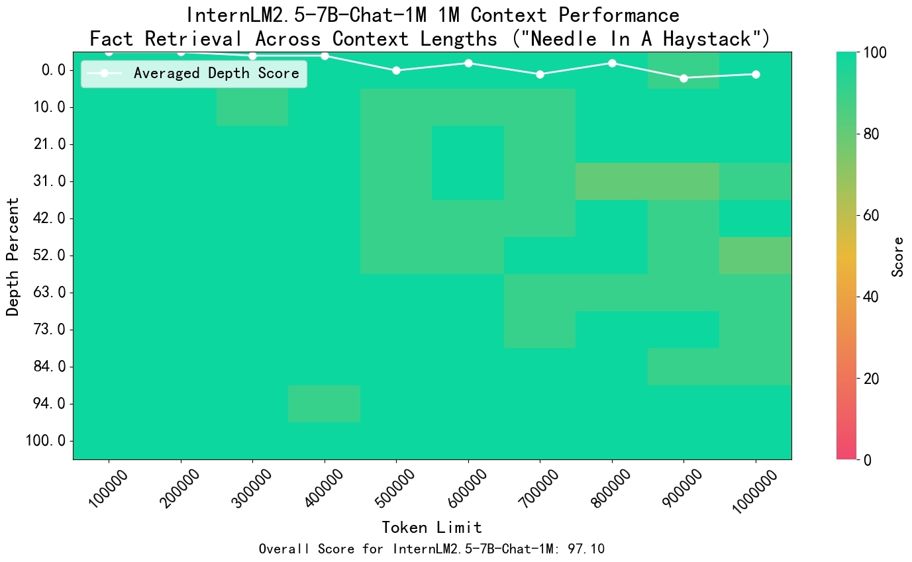
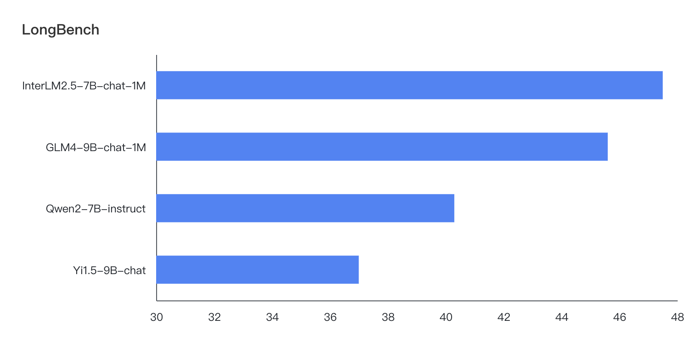

# InternLM with Long Context

## InternLM2.5-7B-Chat-1M 模型介绍

我们推出了 [InternLM2.5-7B-Chat-1M](link)，这是一款能够支持长达 1M token输入的模型。显著提升了模型处理超长文本的能力。

在预训练阶段，我们使用了包含 256K 字符的自然语言语料。为了应对由于数据同质性导致的领域偏移，我们加入了合成数据以维持模型的能力并扩展其上下文理解力。

我们采用了“*大海捞针*”的方法来评估模型从长文本中检索信息的能力。结果显示，InternLM2.5-7B-Chat-1M 能够在长达 100 万字符的文档中准确地定位关键信息。

<p align="center">

</p>

我们还使用了 [LongBench](https://github.com/THUDM/LongBench) 基准来评估长文档理解能力。我们的模型在测试中达到了最优性能。

<p align="center">

</p>

## 使用 InternLM2.5-1M 进行文档聊天

这一部分提供了如何使用 [InternLM2.5-7B-Chat-1M]() 来处理输入文档的简要概述。为了获得最佳性能，特别是在处理极长输入时，我们强烈推荐使用 [LMDeploy]() 进行模型服务。

### 支持的文档类型

目前我们支持 PDF、TXT 和 Markdown 文件，很快将支持更多文件类型！

- TXT 和 Markdown 文件：可以直接处理，无需转换。
- PDF 文件：我们开发了 [Magic-Doc](https://github.com/magicpdf/Magic-Doc) 这个轻量级的开源工具，用于将多种文件类型转换为 Markdown。

### 安装

开始使用前，请安装所需的包：
```bash
pip install "fairy-doc[cpu]"
pip install streamlit
pip install lmdeploy
```

### 部署模型

从 [HuggingFace](xxx) 下载我们的模型。

使用以下命令部署模型。你可以指定 `session-len`（sequence length）和 `server-port`。

```bash
lmdeploy serve api_server {path_to_hf_model} \
--model-name internlm2-chat \
--session-len 65536 \
--server-port 8000
```

要进一步增加序列长度，我们建议添加以下参数：
`--max-batch-size 1 --cache-max-entry-count 0.7 --tp {num_of_gpus}`

### 启动 Streamlit demo

```bash
streamlit run long_context/doc_chat_demo.py \
-- --base_url http://0.0.0.0:8000/v1
```

你可以根据需要指定端口。如果在本地运行演示，URL 可以是 `http://0.0.0.0:{your_port}/v1` 或 `http://localhost:{your_port}/v1`。对于云服务器，我们推荐使用 VSCode，可以无缝端口转发。

对于长输入，我们建议使用以下参数：

- Temperature: 0.05
- Repetition penalty: 1.02

当然，你可以根据需要在 web UI 中调整这些设置以获得最佳性能。

以下视频演示了效果。

https://github.com/libowen2121/InternLM/assets/19970308/1d7f9b87-d458-4f24-9f7a-437a4da3fa6e

## 🔜 敬请期待更多

我们将持续优化我们的模型，以更好地理解和推理长文本输入。敬请期待新功能、性能提升和功能扩展，都在即将到来的更新！